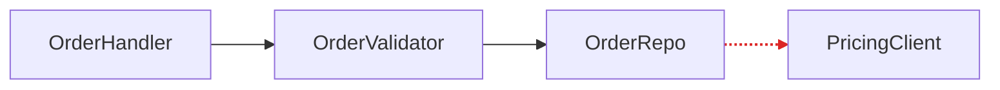

# Report format

One Markdown file. The diagrams carry the weight; prose is sparse and plain.

```markdown
# Architecture review: <repo name>

<date> · Legend: box = module, dotted edge = seam, red edge = leakage, thick box = deep module

## 1. <Candidate title>
...

## Top recommendation

<Candidate name>, linked to its heading: <one sentence on why>.
```

## Candidate section

- **Title**: short, and names the deepening, for example "Collapse the Order intake pipeline".
- **Badges** on one line: recommendation strength (`Strong`, `Worth exploring`, or `Speculative`) and dependency category (`in-process`, `local-substitutable`, `ports & adapters`, or `mock`).
- **Files**: a list of paths in code spans.
- **Before / After**: two diagrams, the centrepiece. See the patterns below.
- **Problem**: one sentence on what hurts.
- **Solution**: one sentence on what changes.
- **Wins**: bullets of six words or fewer, named in vocabulary terms: "locality: bugs concentrate in one module", "leverage: one interface, N call sites", "interface shrinks; implementation absorbs the wrappers".
- **ADR conflict**, if any: one line in a blockquote, for example `> ⚠ Contradicts ADR-0007, but worth reopening because …`.

If a diagram needs a paragraph to be understood, redraw the diagram.

## Diagram patterns

Pick the pattern that fits each candidate, and vary them across the report.

- **Mermaid `flowchart`**: dependencies and call flow ("X calls Y calls Z, and look at the mess"). Colour leakage edges red with `linkStyle`, and give the deep module a thick border with `classDef`.
- **Mermaid `sequenceDiagram`**: round trips ("before: 6 calls; after: 1").
- **Cross-section**: layers a call passes through. Before: six thin layers that each do nothing. After: one thick layer with the consolidated responsibility. Use a `text` block of stacked boxes.
- **Mass diagram**: interface size against implementation size. Before: the two bars are nearly equal (shallow). After: a short interface bar over a long implementation bar (deep). Use a `text` block.
- **Call-graph collapse**: before, a tree of calls; after, one module with the now-internal calls listed inside it.



## Tone

Plain and concise, with the architecture nouns and verbs from the `codebase-design` skill: module, interface, implementation, depth, deep, shallow, seam, adapter, leverage, locality. If a term is not in that vocabulary, reach for one that is before you invent a new one.

Phrasings that fit:

- "Order intake module is shallow: interface nearly matches the implementation."
- "Pricing leaks across the seam."
- "Deepen: one interface, one place to test."
- "Two adapters justify the seam: HTTP in prod, in-memory in tests."

If a sentence can be a bullet, make it a bullet. If a bullet can be cut, cut it.
